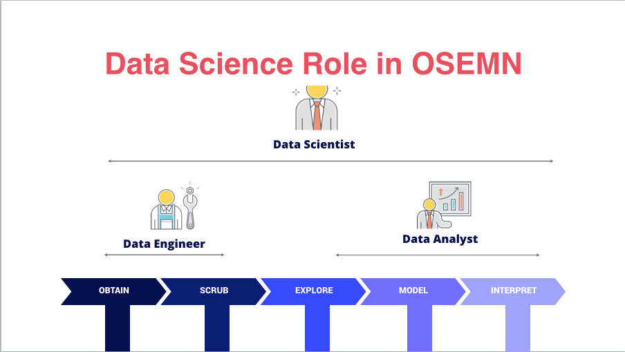

# OSEMN Model
Data science (Mason & Wiggins, 2010) according to the following five steps: 

## 1. Obtener datos
========================================================

- Descargar datos desde otro lado
- Consultar una base de datos
- Consultar una API
- Extraer datos de un archivo
- Generar tus propios datos

Este paso incluye el ¿Dónde lo guardo de manera _efectiva_?

## 2. Manipular datos
========================================================

- Filtrar líneas
- Extraer columnas
- Reemplazar valores
- Manejar los valores
- Convertir los datos de un tipo al otro

Este paso incluye el ¿Cómo lo manipulo/limpio de manera _efectiva_?

## Preguntas
========================================================
- ¿Sus datos son estáticos o dinámicos?
- ¿Dónde los voy a almacenar?
  - Base de datos, web, etc
  - Infraestructura como servicio (IaaS)
- ¿En qué formato?
- ¿Cómo presentamos los datos?
  - Visualización, descarga, acceso, etc.
- ¿Estoy en **big data**?
  - Memoria.
  - Columnas, no sólo renglones.

### 3. Exploración
========================================================
* Buscar en tus datos
* Estadísticas de tus datos
* Crear visualizaciones interesantes

### 4. Modelado 
Las técnicas para crear modelos incluyen: clustering, clasificación, regresión y reducción de la dimensionalidad.

### 5. Interpretación de los datos
* Sacar conclusiones de sus datos		
* Evalúa el significado de tus datos			
* Comunicación efectiva de los resultados

## Roles

